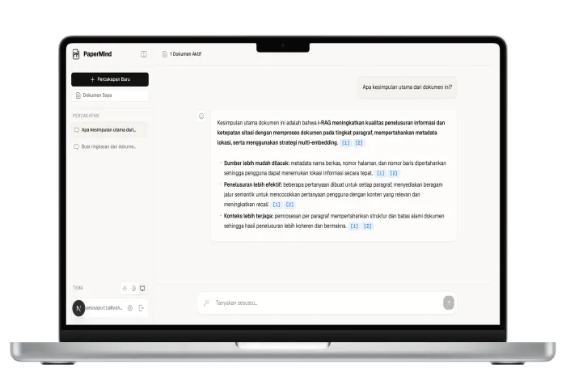
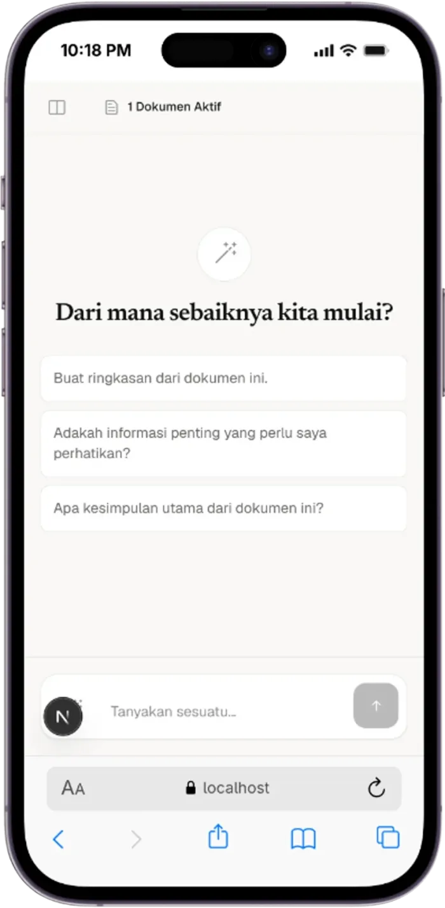

# PaperMind

Chat with your PDF documents and trace answers back to their source pages. PaperMind combines a Next.js interface with a FastAPI retrieval pipeline, Supabase Auth, and PostgreSQL with `pgvector`.



## What it does

- Upload PDFs and process them in the background for search and chat.
- Ask questions across documents and receive streamed answers with page-level citations.
- Reopen previous conversations and preview cited document pages.
- Bring your own model and embedding API keys. Provider keys are encrypted before storage; supported chat providers include Gemini, OpenAI, OpenRouter, and OpenAI-compatible endpoints.
- Keep each user's documents and chats isolated with Supabase Auth and row-level security.

### Suggested starting questions



## Stack

| Component | Technology |
| --- | --- |
| Web | Next.js 15, React 19, TypeScript, Tailwind CSS v4 |
| API | FastAPI, Pydantic, Server-Sent Events |
| Retrieval | LangChain, PyMuPDF, Supabase PostgreSQL with `pgvector` |
| Identity | Supabase Auth and PostgreSQL row-level security |

## Run locally

You need Python 3.11+, Node.js 18+, npm, and a Supabase project. Configure at least one chat provider and an embedding provider in the app after signing in.

1. Apply the SQL files in `supabase/migrations/` to your Supabase database **in filename order**.
2. Start the backend:

   ```bash
   cd backend
   python -m venv venv
   source venv/bin/activate  # Windows: venv\Scripts\activate
   pip install -r requirements.txt
   cp .env.example .env
   # Set SUPABASE_URL, SUPABASE_SECRET_KEY, SETTINGS_ENCRYPTION_KEY,
   # and your project's SUPABASE_JWKS_URL in .env.
   uvicorn app.main:app --reload --port 8000
   ```

3. In another terminal, start the frontend:

   ```bash
   cd frontend
   npm install
   cp .env.example .env.local
   # Set NEXT_PUBLIC_SUPABASE_URL and NEXT_PUBLIC_SUPABASE_PUBLISHABLE_KEY.
   npm run dev
   ```

Open [localhost:3000](http://localhost:3000). The API runs at [localhost:8000](http://localhost:8000), with interactive API docs at [localhost:8000/docs](http://localhost:8000/docs). Set `NEXT_PUBLIC_API_URL` in `frontend/.env.local` if the API is elsewhere.

> [!IMPORTANT]
> Never commit real API keys or `.env` files. The Supabase secret key and encryption key belong on the backend only.

### Docker Compose

For the development containers, create `backend/.env` and `frontend/.env` from their respective examples. Also set `NEXT_PUBLIC_SUPABASE_URL`, `NEXT_PUBLIC_SUPABASE_PUBLISHABLE_KEY`, and `NEXT_PUBLIC_API_URL` in the **root** `.env` file for Compose build arguments. Then run:

```bash
docker compose up --build -d
curl http://localhost:8000/health
```

## Check the project

```bash
cd backend && python -m pytest tests/
cd ../frontend && npm run build
```
